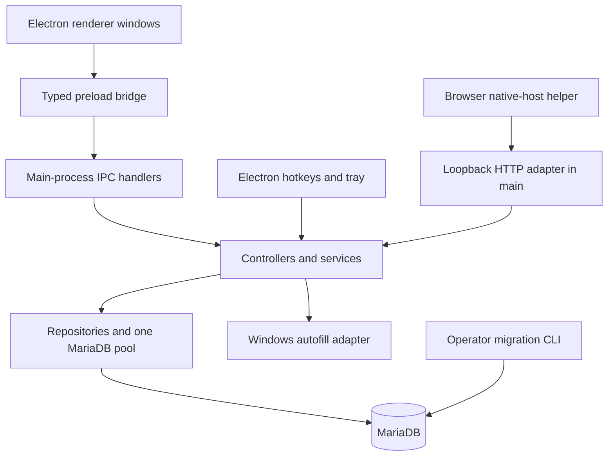

# Agent implementation brief: migrate Password Vault to Electron and TypeScript

Prepared from repository inspection on 2026-10-03 and revised to use **Electron as the application framework**. This is a plan only; no application code or database was changed. Scope includes **every Python file, including autofill agents**. Establish the Electron process boundaries first, implement the controller and database foundation, then migrate every caller. This file is the implementation brief for the Electron refactor.

## Objective and boundaries

Deliver a packaged Electron desktop application written in TypeScript. Electron owns application startup, background/tray lifecycle, windows, hotkeys, controllers/services, and the MariaDB connection pool. Retain the existing local HTTP API as a compatibility adapter for external callers and the browser native host. Desktop windows call typed Electron IPC. Finish with no Python runtime, Python subprocess, SQLAlchemy, or Alembic dependency in build, startup, tests, or migrations.

Preserve existing MariaDB data, IDs, relationships, and the project's current plaintext storage design. Encryption redesign, a new dashboard, Android automation, cloud deployment, and browser-extension product development are separate work. Native dependencies and SQL/HTML/CSS assets are acceptable; all application logic formerly written in Python becomes TypeScript.

The live database version, schema, collation, timezone convention, and populated legacy tables have **not** been inspected. Treat the repository as evidence of intent and drift, not proof of production state. Do not import or print the CSV files under `db/`; they are unnecessary for the migration plan or synthetic tests.

## Recommended implementation decisions

| Concern        | Decision                                                                                                 | Reason                                                                                |
| -------------- | -------------------------------------------------------------------------------------------------------- | ------------------------------------------------------------------------------------- |
| Application    | Electron with TypeScript main, preload, and renderer builds                                              | One owner for desktop lifecycle and application services                              |
| Runtime/build  | Electron Forge, strict TypeScript, npm lockfile; compile production entry points                         | Package Electron's embedded runtime; use compatible Node.js LTS for development/tools |
| HTTP adapter   | Fastify hosted by Electron main with explicit request/response schemas                                   | Preserve external `/api` clients; desktop windows use IPC                             |
| Desktop IPC    | Typed `contextBridge` methods, `ipcRenderer.invoke`, and validated `ipcMain.handle` handlers             | Share controllers without exposing generic privileged access                          |
| Validation     | Zod for shared domain/IPC validation; HTTP boundary maps its errors to the existing API envelope         | One set of input rules shared by API, desktop, and browser                            |
| Database       | Official `mariadb` Node.js connector, parameterized SQL, typed row mappers                               | Five small application tables and an existing SQL trigger do not require an ORM       |
| Migrations     | `umzug`, TypeScript migration modules containing explicit MariaDB SQL, database-backed migration storage | Keep trigger, index-prefix, enum, and timestamp behavior visible                      |
| Desktop UI     | Local HTML/CSS/TypeScript BrowserWindows, tray, `globalShortcut`, clipboard                              | Replaces tkinter and provides the primary application experience                      |
| Windows access | Narrow TypeScript Win32 wrapper using `koffi`                                                            | Foreground window/process lookup, focus restoration, keyboard injection               |
| Browser host   | Compiled Node.js stdio helper with a bundled runtime; authenticated client of Electron's local API       | Browser-launched helper shares no application lifecycle or DB ownership               |
| Tests          | Vitest plus an isolated real MariaDB instance; Windows desktop smoke harness                             | Verify transactions/triggers against the actual database engine                       |

Electron is the required application framework; the supporting library choices are design recommendations, not measured performance claims. Pin mutually compatible versions when implementation starts; record Electron's embedded Node version separately from the development/tooling Node version. Validate MariaDB connector and native-module compatibility against the packaged Electron runtime. Keep one repository/package initially and avoid adding an ORM, React, a DI framework, or a second migration system. Use Electron Forge for development, packaging, and installer creation; choose its supported TypeScript build integration during the initial packaging spike. See [Electron Forge](https://www.electronforge.io/).

The connector provides pooling and Promise-based transactions; Umzug supports TypeScript migrations and custom storage independently of Sequelize. See [MariaDB Connector/Node.js](https://mariadb.com/docs/connectors/mariadb-connector-nodejs/connector-nodejs-promise-api), [Umzug](https://github.com/sequelize/umzug), and [Fastify TypeScript support](https://fastify.dev/docs/latest/Reference/TypeScript/).

## Electron application architecture

Use these process and ownership boundaries, consistent with [Electron's process model](https://www.electronjs.org/docs/latest/tutorial/process-model):

| Boundary           | Responsibilities                                                                                               | Access                                                             |
| ------------------ | -------------------------------------------------------------------------------------------------------------- | ------------------------------------------------------------------ |
| Main process       | App lifecycle, tray/windows, IPC handlers, controllers/services, pool, optional HTTP listener, Windows adapter | Node.js, Electron main APIs, MariaDB and Win32                     |
| Preload            | Expose a small typed `window.vault` API; map fixed methods to IPC channels                                     | `contextBridge` and selected IPC methods; no database code         |
| Renderers          | Candidate selection, save form, notifications/status presentation                                              | DOM and the preload API; no DB credentials, filesystem, or raw IPC |
| Regex worker       | Bounded pattern evaluation with timeout/replacement                                                            | Only supplied pattern/title data; no DB or secret payloads         |
| Native-host helper | Browser framing and authenticated API requests                                                                 | Protocol stdin/stdout; no DB pool and no Electron windows          |
| Operator tools     | Schema inspection, migrations, backup/restore runbook                                                          | Separate short-lived connections and migration privileges          |



### Module layout and dependency rules

Keep domain, services, controllers, and repositories as plain TypeScript modules so database and HTTP tests can run without opening Electron. Electron main is their production composition root. IPC and HTTP adapters call the same controllers and translate their results into transport-specific envelopes.

```text
src/
  desktop/
    main.ts                # Electron entry point and composition root
    lifecycle.ts           # Startup, tray/background operation, shutdown
    windows.ts             # BrowserWindow creation and operation ownership
    ipc.ts                 # Main-process handler registration
    preload.ts             # Bundled sandbox-compatible context bridge
    renderer/              # Candidate/save/status HTML, CSS and TypeScript
  shared/ipc.ts            # Renderer-safe request/result/channel contracts
  config.ts
  domain/                  # Types, validation, normalization, errors
  controllers/
  services/
  repositories/
  db/                      # Pool, transaction helper, health and row mapping
  http/                    # Existing local API adapter, owned by main
  autofill/                # Adapter interface, Windows workflow, native protocol
  platform/windows.ts      # Narrow Koffi/Win32 bindings
  workers/                 # Regex evaluator and worker lifecycle
  entrypoints/native-host.ts
scripts/                   # Operator tools, including DB doctor and migration CLI
migrations/                # Versioned TypeScript migration modules
forge.config.ts
```

Use separate TypeScript configurations/build targets for main/tooling, preload, and DOM renderers. Renderer imports may reach only renderer-safe shared contracts. Enforce the boundary through lint/import rules. Bundle preload code to work with sandboxed preload restrictions; it must not import the application's Node/database dependency graph. Never send connections, Error objects with SQL details, or native handles to a renderer.

### IPC contracts

Define a fixed method per allowed action: `getCandidates(operationId)`, `selectCandidate(operationId, credentialId)`, `saveCredential(operationId, input)`, `cancelOperation(operationId)`, and `getStatus()`. Add controller-backed metadata methods only for a screen that needs them. Do not expose arbitrary `send(channel, payload)`, SQL execution, or a renderer-facing password retrieval method.

Main creates the operation ID and stores the original target HWND/PID/context and allowed candidate IDs. A renderer submits only its operation ID and selection; main checks ownership, eligibility, and operation freshness before retrieving a secret and filling the target. Validate request shape and sending frame/window for every handler. Return serializable discriminated success/error results with stable codes and sanitized messages. Event subscriptions return cleanup functions and never pass Electron event objects through the bridge. See [Electron IPC](https://www.electronjs.org/docs/latest/tutorial/ipc).

### Startup, background operation, and shutdown

1. Acquire `app.requestSingleInstanceLock()` before creating services. A second launch focuses the existing relevant window/status view and exits without opening another DB pool or registering hotkeys.
2. After `app.whenReady()`, load validated configuration, create one pool, check connectivity and schema compatibility read-only, and initialize controllers. Resolve packaged asset paths explicitly; never depend on the shell's working directory.
3. Create the tray, register IPC and hotkeys, and start the loopback HTTP adapter when enabled. Keep the adapter enabled in the compatibility configuration when a token is supplied. Desktop IPC works independently of HTTP; invalid enabled HTTP configuration produces an actionable error. A port conflict is reported without connecting to an unknown process.
4. Closing a popup ends that interaction; it does not quit the background agent. Provide tray status and an explicit Quit action. Create popup windows on demand and release them when closed.
5. On explicit quit, prevent new operations, unregister hotkeys, cancel pending fills/workers, close windows, stop/drain HTTP work, finish or roll back owned transactions, and close the pool. Use one guarded asynchronous shutdown path with a bounded wait. Verify hotkey/tray cleanup on both normal quit and startup failure.

For missing or incompatible schema, show a setup-required state with the operator command; never run migrations silently. On DB loss, keep the tray responsive, reject new secret operations, and offer a health retry without creating multiple pools. Electron owns the lifecycle; a separate headless application server is outside this refactor. See [Electron app lifecycle](https://www.electronjs.org/docs/latest/api/app).

### Configuration and distribution

Retain existing environment names for development and operator tools. For installed launches, support a documented per-user configuration location under Electron's `userData` path, resolved by main; do not package `.env`, database credentials, dumps, or tokens in the installer or renderer bundle. Keep protected token configuration accessible to the native-host launcher through an explicit per-user path. Document configuration precedence and restrict access to the installed config.

MariaDB remains an external server configured by the user/operator. The installer packages application assets and required runtimes; it does not embed a database or alter its schema. Ship the compiled migration tools as a documented operator artifact. Package the native-host helper and its Node runtime explicitly so browser integration does not depend on a system `node` installation or Electron's `ELECTRON_RUN_AS_NODE` mode.

Create a Windows x64 installer with Forge, retaining a packaged-directory smoke-test target. Include compiled main/preload/renderer assets, workers, and required native binaries. Verify production native-module resolution and writable configuration paths from an installed launch. Publishing/signing credentials and automatic updates are deployment concerns; document them without adding an updater to the migration scope.

## Repository findings Gemini must address

| Evidence                                                                                                                  | Required treatment                                                                               |
| ------------------------------------------------------------------------------------------------------------------------- | ------------------------------------------------------------------------------------------------ |
| `app/controller/credential.py`: `CredentailQuery` has annotations but no constructor, although constructed with arguments | Replace with explicit DTO mapping; repair list behavior                                          |
| `read_one_credential()` returns an ORM entity after a committing session closes                                           | Return plain values; eliminate detached/expired-entity behavior                                  |
| Metadata update uses full create validation and has an undefined `credential_id` in its error handler                     | Separate create/update validation; preserve the original error                                   |
| `create_credential_with_rules()` passes `is_enabled` twice and calls nonexistent `log.infor()`                            | Validate every rule first; insert credential/rules atomically; use one real logging interface    |
| Some error calls omit required `object_id`; logging opens another DB transaction                                          | Make object ID nullable; avoid masking the original operation failure or exhausting a small pool |
| `app/api.py` commits password and metadata changes separately                                                             | One service transaction for each PATCH                                                           |
| `CredentialService.save_password()` commits credential and each generated rule separately                                 | Reuse the atomic credential-with-rules operation                                                 |
| Validators perform DB logging, coerce arbitrary values, and disagree with model enums                                     | Make validators pure, strictly typed, and consistent with the verified schema                    |
| Candidate lookup compares `window_title_regex` by equality; matcher does no domain normalization                          | Implement actual bounded regex matching and shared normalization                                 |
| `app.py` logs API tokens; DB exception strings can contain parameters                                                     | Redact logs and return sanitized errors                                                          |
| Windows code can continue filling after focus restoration fails; shared target state is overwritten by concurrent hotkeys | Per-operation context, one active interaction, verified focus before input                       |
| Runtime hotkeys are `Ctrl+F1` / `Ctrl+F2`, despite different docstrings                                                   | Preserve actual defaults; document configurable overrides                                        |
| `browser_native_host.py` is empty                                                                                         | New minimal implementation, not an existing working feature to claim parity with                 |
| Initial Alembic migration creates encrypted `vault_items`/`vault_meta`; current models use plaintext `credentials`        | Inspect and classify the live database before adoption                                           |
| Alembic revisions `5afe6348060e` and `be4beac9cf54` both create the same rule index                                       | Do not replay or mechanically translate this history                                             |
| `db/schema.sql` has a full index on a 2048-character utf8mb4 column; models use a 255-character prefix                    | Reconcile index definition against actual MariaDB limits                                         |
| ORM timestamps differ from `db/schema.sql`; password-history trigger exists only in model SQL/setup script                | Explicitly migrate and verify defaults, update behavior, precision, and trigger                  |
| `test_db_setup.py` creates current tables and then describes old vault tables                                             | Replace with a read-only doctor and separate migrations/integration tests                        |

## Complete source mapping

Use a single shared core instantiated by Electron main. Desktop IPC and the embedded HTTP adapter call the same controllers; repositories own SQL. Pass a transaction connection explicitly instead of opening nested transactions. Operator CLIs import only the required database modules and have their own short-lived connections.

| Existing source                                      | TypeScript destination / disposition                                                                                                                                            |
| ---------------------------------------------------- | ------------------------------------------------------------------------------------------------------------------------------------------------------------------------------- |
| `app.py`                                             | `src/desktop/main.ts`, `src/desktop/lifecycle.ts`; Electron owns startup, services, HTTP and shutdown                                                                           |
| `app/config.py`                                      | `src/config.ts`; preserve DB/local API environment names                                                                                                                        |
| `app/db.py`                                          | `src/db/pool.ts`, `src/db/transaction.ts`, `src/db/health.ts`                                                                                                                   |
| `app/models.py`                                      | `src/domain/types.ts`, `src/db/rows.ts`, explicit SQL migrations                                                                                                                |
| `app/exceptions.py`                                  | `src/domain/errors.ts`; remove unused aliases after all callers move                                                                                                            |
| `app/controller/credential.py`                       | `src/controllers/credential.ts`, `src/repositories/credential.ts`                                                                                                               |
| `app/controller/autofill_rule.py`                    | `src/controllers/autofill-rule.ts`, `src/repositories/autofill-rule.ts`                                                                                                         |
| `app/controller/log.py`                              | `src/controllers/log.ts`, `src/repositories/log.ts`, sanitized operational logger                                                                                               |
| `app/controller/validator.py`                        | `src/domain/validation.ts`, `src/domain/normalization.ts`                                                                                                                       |
| `app/credential_service.py`                          | `src/services/credential.ts`                                                                                                                                                    |
| `app/autofill_matcher.py`                            | `src/services/autofill-matcher.ts`                                                                                                                                              |
| `app/api.py`                                         | `src/http/app.ts`, routes, serializers, authentication/error handlers; main owns the listener, and `src/desktop/ipc.ts` exposes desktop operations through the same controllers |
| `app/autofill/base.py`                               | `src/autofill/types.ts` adapter interface                                                                                                                                       |
| `app/autofill/windows_agent.py`                      | `src/autofill/windows.ts`, `src/platform/windows.ts`, `src/desktop/windows.ts`, `src/desktop/preload.ts`, `src/desktop/renderer/`                                               |
| `app/autofill/browser_native_host.py`                | `src/entrypoints/native-host.ts`, `src/autofill/native-protocol.ts`                                                                                                             |
| Three package `__init__.py` files                    | Normal TypeScript module exports where needed; no empty-file port                                                                                                               |
| `test_db_setup.py`                                   | `scripts/db-doctor.ts`, integration fixtures and tests                                                                                                                          |
| `migrations/env.py`, `script.py.mako`, `alembic.ini` | `scripts/migrate.ts`, migration storage, TypeScript template, environment configuration                                                                                         |
| Four `migrations/versions/*.py` files                | Document legacy revision lineage; replace operational use with a verified baseline and forward migrations                                                                       |

Keep legacy code available in Git during implementation. Once acceptance gates pass, remove Python files and obsolete Alembic configuration from the working tree; retain revision lineage in documentation and Git history. Update `password_vault_module_plan.md` to point to the new architecture. Make `db/schema.sql` a generated/reference snapshot or retire it; it must not remain a competing schema authority.

## Core behavior contract

1. Use separate `CredentialSummary`, `CredentialSecret`, `Candidate`, `AutofillRule`, and log DTOs. Summary/candidate SQL must omit `password` and `totp_secret`; preserve the existing `notes` field where the API already includes it. Password history remains an explicit internal operation; do not add a public history endpoint implicitly.
2. Generate IDs with `crypto.randomUUID()` in the service. Reject client-supplied IDs in create bodies. Treat generated IDs as immutable.
3. Create requires title, platform type, username, and a nonempty string password. Preserve password bytes, including spaces; do not trim or normalize secrets. PATCH validates only present writable fields; omitted means unchanged, `null` clears nullable fields, and empty password is invalid.
4. Match the verified enum values in stored data, including the model's Android-related values, without pretending an Android adapter exists. Normalize tags to trimmed, lowercase, deduplicated strings. Validate booleans and integer priorities without JavaScript truthiness coercion.
5. `createCredentialWithRules`, desktop save, and combined metadata/password PATCH each use one connection and transaction. Validate inputs before writes. Use row locking where a read/modify/write sequence requires it; avoid unnecessary reads for direct updates.
6. Preserve controller capabilities: credential create/read/list/update/delete/history; rule create/list/update/delete/candidates; error-log write/get/list by event/list by object/delete; information-log write. Public methods return typed IDs/objects/results, and API handlers render legacy message envelopes.
7. Define not-found errors consistently as HTTP 404, invalid domain input as 422, malformed JSON/body as 400, auth failure as 401, and unexpected errors as sanitized 500. Document corrected legacy paths that previously returned inconsistent errors.
8. An unchanged update is successful when the row exists; do not interpret a driver's zero changed-row count as proof of absence.
9. Put successful DB audit writes on the same transaction connection if required for that operation. Error reporting after rollback is best effort and must preserve the original error. Never log raw SQL parameters, secrets, API tokens, or request bodies. Avoid duplicate logs at each layer.
10. Preserve existing public snake_case fields and response envelopes. Internal method names may use camelCase. Establish timestamp serialization from actual stored semantics; do not append `Z` to timezone-naive legacy values without resolving their timezone.

Capture the actual routes in contract tests: `GET /health`; CRUD `/api/credentials` and `/api/credentials/:id`; `POST /api/credentials-with-rules`; GET/POST `/api/credentials/:id/rules`; PATCH/DELETE `/api/rules/:id`; POST `/api/autofill/candidates` and `/api/autofill/payload`. The actual prefix is `/api`, despite `/v1` references in earlier documentation. Preserve success status codes and existing response field sets; document deliberate bug fixes.

The API binds to loopback by default and requires `X-Local-Token`, except for health. Require a configured token for enabled HTTP/native-host operation rather than printing a generated token. Use constant-time token comparison with proper length handling. Electron main owns the HTTP listener and the sole application pool; desktop windows use IPC and never receive the HTTP token. The native host is an external API client. Migrations never run automatically at normal app startup.

## MariaDB migration workflow and tools

### A. Inspect without mutating

Implement `npm run db:doctor` first. It should collect version, storage engine, charset/collation, SQL mode, timestamp defaults/precision, schema objects, indexes/prefix lengths, foreign keys, triggers, and Alembic revision if present. Use the connector or MariaDB CLI for `SHOW CREATE TABLE`, `SHOW CREATE TRIGGER`, and `information_schema` queries. Produce a structural report with no credential values.

Classify the database:

| State                                         | Action                                                                                                             |
| --------------------------------------------- | ------------------------------------------------------------------------------------------------------------------ |
| Empty application schema                      | Apply the new TypeScript baseline normally                                                                         |
| Current plaintext schema matches the baseline | Verify structure and record baseline adoption without replaying CREATE statements                                  |
| Plaintext schema has known drift              | Apply explicit, tested reconciliation steps on a clone, then verify and adopt                                      |
| Populated encrypted legacy schema             | Halt automatic data conversion; require a separate migration with verified decryption/key access and field mapping |
| Mixed, partial, or unknown schema             | Produce a precise diff; do not stamp a baseline or drop tables                                                     |

A language migration does not require exporting and reimporting healthy plaintext tables. Prefer reusing the existing database with additive schema fixes. Never reinterpret ciphertext as plaintext or silently remove `vault_items`/`vault_meta`.

### B. Backup and rehearsal

Use `mariadb-dump` for a logical backup, including triggers and any existing routines/events. Restore it with the `mariadb` client into an isolated database and prove the restore before modifying the real database. Store dumps outside the repository with restricted access. Use prompted passwords or protected client option files, never passwords in command arguments.

For InnoDB, use `--single-transaction` with schema changes paused during the dump; verify engines first. On Windows prefer the dump tool's `--result-file` to avoid shell redirection encoding surprises. Record a restore command/runbook and object/count verification, without printing secret rows. See [mariadb-dump](https://mariadb.com/docs/server/clients-and-utilities/backup-restore-and-import-clients/mariadb-dump).

### C. One migration runner

Implement these project commands; they are required interfaces to create, not claims that they already exist:

| Command                                | Expected behavior                                                           |
| -------------------------------------- | --------------------------------------------------------------------------- |
| `npm run db:doctor`                    | Read-only connectivity/schema report                                        |
| `npm run db:migrate:status`            | Applied/pending migrations and detected checksum mismatch                   |
| `npm run db:migrate:plan`              | Preconditions and intended SQL/object changes without mutation              |
| `npm run db:baseline -- --adopt`       | Verify an existing baseline exactly before recording adoption               |
| `npm run db:migrate:up`                | Apply pending migrations in order                                           |
| `npm run db:migrate:verify`            | Check target schema, constraints, defaults, indexes, and trigger definition |
| `npm run db:migrate:down -- --steps 1` | Explicit reversible development rollback only                               |

Use Umzug with a small custom MariaDB storage implementing executed/log/unlog operations. Store migration name, checksum, and application time in a dedicated `schema_migrations` table. Implement checksum validation in the wrapper; it is not an automatic Umzug guarantee. Record baseline provenance separately, including observed legacy revision and inspected schema fingerprint.

Serialize migration runs with a database advisory lock held by one dedicated connection; release it in `finally`. Bootstrap bookkeeping under the same lock. Run DDL on that connection and record a migration only after its postconditions pass. Keep a stable logical migration ID across `.ts` development and compiled `.js` builds; avoid applying both glob sets or hashing generated JavaScript differently across builds.

MariaDB DDL can implicitly commit, including table/index/trigger changes. Consequently a failed migration can leave partial schema changes even if the bookkeeping row was not recorded. Each migration needs preconditions, postconditions, and a documented resume/repair procedure. Do not advertise DDL rollback as transactional. See [MariaDB implicit commits](https://mariadb.com/docs/server/reference/sql-statements/transactions/sql-statements-that-cause-an-implicit-commit).

### D. Baseline and reconciliation content

Create `0001_plaintext_baseline.ts` with the five application tables: `credentials`, `autofill_rules`, `password_history`, `error_logs`, and `infor_logs`. Retain the existing `infor_logs` name to avoid an unrelated rename. Baseline adoption must verify the same objects; drift repair is a separately recorded, fingerprint-specific operation and must not secretly stamp an incomplete baseline.

Resolve these details explicitly:

- Keep `CHAR(36)` IDs, existing field lengths, enum members, nullable columns, InnoDB, and verified utf8mb4 collation. Foreign keys from rules/history must use `ON DELETE CASCADE`.
- Use the verified prefix index `(match_type, match_value(255))` rather than the full 2048-character utf8mb4 index. Queries still compare the complete value; a prefix index does not change equality semantics.
- Keep defaults for favorite/enabled/priority in the DB. Define `created_at`/`updated_at` precision and update behavior explicitly instead of relying on SQLAlchemy's Python-side `onupdate`.
- Inspect whether old timestamps are local wall time or UTC. Preserve old values during adoption. If normalization is needed, design a separate data migration with a verified source timezone; do not silently shift existing dates.
- MariaDB's `JSON` type is an alias for validated text storage. Map tags reliably for connector versions that return a parsed value versus a string; map SQL NULL to `[]` at the API boundary. Validate array-of-string content. See [MariaDB JSON](https://mariadb.com/docs/server/reference/data-types/string-data-types/json).
- Define BOOLEAN/TINYINT mapping and date serialization explicitly. If microseconds must survive, avoid round-tripping DATETIME(6) through JavaScript Date, which cannot retain all six digits.
- Create the password-history trigger in a versioned migration. Send a complete `CREATE TRIGGER ... BEGIN ... END` statement through the connector; `DELIMITER` is a CLI directive and must not be sent as server SQL. Do not split trigger bodies on semicolons.
- The trigger is the sole history writer. Compare old/new passwords byte-exactly, including case and trailing spaces, using a verified binary null-safe comparison; the current comparison inherits collation behavior. One real change produces one old-password row; unchanged password or metadata-only updates produce none.
- Verify trigger definer/privileges when restoring into a different environment. Keep DDL/migration credentials separate from the runtime DB account.

Use forward migrations for later changes. Do not mutate applied migrations, run schema synchronization on startup, use a destructive reset for a populated DB, or create a second independent schema through an ORM.

### E. Database acceptance and cutover

Prove fresh installation and existing-database adoption independently on isolated MariaDB instances matching the deployed version. Compare IDs, row counts, relationships, and schema before/after; verify synthetic secrets through assertions without printing them. Re-running migration-up must be a no-op.

Before cutover, stop the Python process and its hotkeys, take the final backup, run the verified operator migrations, start the packaged Electron app, and smoke-test IPC-driven desktop save/fill plus the compatibility API. Keep one application writer during transition. An application rollback can reuse an unchanged/backward-compatible schema; database restore requires a recovery decision for writes made after backup. Do not automatically drop tables through `down()` during production recovery.

## Autofill migration details

### Matching

Normalize domain inputs using URL parsing and exact hostname equality; normalize Windows process basenames consistently. Apply the same normalization on rule creation and matching. Report existing normalization collisions before rewriting stored rules.

Fetch exact URL/domain/process candidates using indexed queries and explicit summary projections. For window-title rules, evaluate stored patterns against the current title. Python `re` and JavaScript RegExp are not equivalent: scan existing patterns for compatibility, report unsupported ones, and preserve originals until repaired.

Limit pattern/title lengths and run regex work in a reusable worker with a hard timeout and termination/replacement on overrun; length limits alone do not prevent catastrophic backtracking. Do not run arbitrary patterns on the main HTTP/Electron event loop. When saving a captured window title as a rule, escape and anchor it as a literal unless the user explicitly supplied a pattern.

Deduplicate by credential ID using each credential's strongest match. Set deterministic order: match specificity (exact URL before domain; process before title), then priority descending, favorite first, last-used descending with null last, then ID. This is a documented correction to the current first-seen/priority-only behavior. Make it a tested contract.

### Windows desktop

Do a small Windows feasibility spike early, before investing in the entire UI. Prove the selected Electron/Koffi versions in a Forge-packaged Windows x64 build can register both hotkeys, obtain target HWND/PID/title/process, show a popup, exchange typed IPC, restore focus, and send input to a synthetic form. Electron is the fixed framework decision; the spike validates native bindings and packaging.

- Replace tkinter with only the existing candidate picker, save form, and notifications. Preserve Enter/double-click selection, Escape cancellation, favorites, and password masking. No new dashboard.
- Register `Control+F1` and `Control+F2` after Electron is ready; report hotkey conflicts and unregister on quit. Use a single-instance lifecycle. See [Electron globalShortcut](https://www.electronjs.org/docs/latest/api/global-shortcut).
- Put Windows calls behind a testable interface: `GetForegroundWindow`, `GetWindowTextW`, `GetWindowThreadProcessId`, `OpenProcess`/`QueryFullProcessImageNameW`, `CloseHandle`, `SetForegroundWindow`, and `SendInput`. Verify pointer sizes, wide strings, INPUT layout, return values, and handle cleanup. [Koffi](https://koffi.dev/) provides FFI; the implementation still owns correct Win32 bindings.
- Keep DB/service calls and retrieved secrets in the main process. Use the IPC contracts defined above; candidate views get metadata only, and the save form sends entered values once and clears them. Set `contextIsolation: true`, `sandbox: true`, and `nodeIntegration: false` explicitly. Load packaged local assets, use a restrictive content security policy, and reject unexpected navigation/window creation. Do not expose a generic shell or external-URL launcher through IPC. See [Electron security guidance](https://www.electronjs.org/docs/latest/tutorial/security).
- Capture target HWND/PID/context per operation before opening a popup. Prevent overlapping save/fill operations. Verify the same valid target is foreground before every paste/keystroke; cancel when restoration fails, the target exits, or user focus changes.
- Preserve the existing sequence: username paste, Tab, password paste, Enter. Keep timing configurable, wait for hotkey modifiers to be released, and make automatic Enter configurable with the existing behavior documented as the compatibility default.
- Preserve Unicode clipboard paste. Clear only clipboard content still owned by this fill operation, using a clipboard sequence marker/content check; do not erase a newer user copy. Handle cancellation, exceptions, and shutdown cleanup. Dropping JS references is not a guarantee of memory zeroization.
- Do not force elevation to reach protected windows. Focus changes are restricted by Windows; test failure handling instead of assuming `SetForegroundWindow` succeeds. See [Microsoft SetForegroundWindow](https://learn.microsoft.com/en-us/windows/win32/api/winuser/nf-winuser-setforegroundwindow).
- Package native modules outside incompatible bundling paths and verify the packaged artifact, not just a development run. Follow [Electron native-module guidance](https://www.electronjs.org/docs/latest/tutorial/using-native-node-modules).

### Browser native host

The existing file is empty. Deliver a minimal separately testable host supporting candidate lookup and explicitly selected credential payload requests. Do not claim browser autofill is end-to-end complete without an installed extension and integration test.

Implement length-prefixed UTF-8 JSON framing on stdin/stdout, buffering partial reads and multiple frames. On Windows the four-byte native-endian length is little-endian. Reject malformed, truncated, or oversized input; respect backpressure, EOF, and output size limits. Stdout contains protocol bytes only; sanitized diagnostics go to stderr. See [Chrome native messaging](https://developer.chrome.com/docs/extensions/develop/concepts/native-messaging).

Keep framing/parser code independent of the service client. The host calls the authenticated loopback API owned by the running Electron application and does not start a second DB pool or application server. If Electron is closed or its API is disabled, return a defined unavailable response; the initial implementation does not launch a hidden second application instance. Configure its token through a protected local setting or environment supplied by the launcher, never command-line arguments. Provide a Windows launcher using the packaged helper runtime, a manifest template with explicit `allowed_origins`, and installation/uninstallation instructions scoped to the current user. Validate the browser-supplied caller origin against the configured allowlist. Extension IDs are deployment inputs; do not invent or wildcard them.

Candidate requests never return secrets. Payload requests include a chosen credential ID and context; verify it remains eligible for that context before forwarding. Document that the trusted extension owns the user-selection interaction. Test framing and authorization with a harness; use an actual extension for the final browser integration gate.

## Ordered Gemini work packages

Complete each package with a focused diff, relevant test evidence, and the next remaining gate. Do not generate the entire rewrite in one pass.

| Order | Work                                                                                                                | Exit criterion                                                                                        |
| ----- | ------------------------------------------------------------------------------------------------------------------- | ----------------------------------------------------------------------------------------------------- |
| 1     | Inventory Python entry points, controller exports, actual API contracts, existing defects; write behavior fixtures  | Every Python source mapped; intended fixes distinguished from preserved behavior                      |
| 2     | Scaffold Electron Forge with strict main/preload/renderer TypeScript targets, typed IPC and Windows packaging spike | Packaged Electron boots; preload isolation and native bindings demonstrated                           |
| 3     | Read-only DB doctor, baseline design, backup/restore rehearsal, Umzug runner                                        | Fresh install and verified adoption pass on isolated MariaDB                                          |
| 4     | Main-process composition, config, pool/transactions, DTOs, validation, controller/repository CRUD and logs          | One pool owned by Electron; atomicity, cascade, history and secret-projection tests pass              |
| 5     | Credential service and matcher                                                                                      | Save-with-rules atomic; normalized and bounded matching/ranking pass                                  |
| 6     | Typed desktop IPC and embedded HTTP routes/auth/serialization                                                       | IPC authorization and actual `/api` contracts pass through the same controllers                       |
| 7     | Electron tray/windows/lifecycle and Windows desktop integration                                                     | Save/pick/fill/cancel/focus/clipboard, second launch, background mode and quit pass                   |
| 8     | Browser host/launcher/manifest                                                                                      | Framing and host/API tests pass; real-extension gate explicitly recorded                              |
| 9     | Installed Electron cutover rehearsal, Forge installer, operator tooling, documentation and Python retirement        | Installed app and helper work without development tools; migrations need no Python; rollback verified |

Scripts to deliver: `start` (Electron Forge development launch), `dev:desktop` (alias), `build`, `build:tools`, `typecheck`, `lint`, `test`, `test:integration`, `test:ipc`, `test:native-host`, `test:windows`, `package:windows` (packaged application directory), `make:windows` (installer), and the DB commands above. Do not create a separate `dev:server` application entry point. HTTP tests instantiate the adapter without listening or launching Electron. Keep Electron imports out of the shared core, migration CLI, and native-host helper. Externalize runtime native modules from JS bundles and configure packaging/unpacking as required by the selected native module.

## Required verification

- Validation: create versus partial PATCH, strict booleans, null/omitted behavior, Unicode, tag normalization, password whitespace preservation, URL/domain/process normalization, unsupported regex.
- MariaDB integration: fresh baseline, valid adoption, drift rejection, duplicate runner lock, checksum mismatch, repeat no-op, partial DDL failure recovery, restore rehearsal, JSON/boolean/date mapping, update timestamps, foreign-key cascades.
- Transaction behavior: invalid second rule leaves no credential/rules; failing metadata update does not change password/history; concurrent changes preserve expected history; logger failure does not mask the primary error.
- Password trigger: changed password, unchanged password, case-only change, trailing-space change, and metadata-only change. Assert exact history count and value using synthetic data.
- API: each actual route, HTTP codes/envelopes, malformed body, missing/invalid token, missing IDs, no secrets in summaries/candidates/error responses/logs. Check query projections as well as serialization.
- Electron IPC: reject unknown actions, malformed input, foreign frames/windows, stale operation IDs and candidates outside the captured operation. Verify IPC and HTTP share controller behavior; retrieved passwords, DB settings and API tokens never enter renderer responses.
- Electron lifecycle: single instance, close-popup-without-quitting, explicit tray Quit, failed startup, schema mismatch, DB reconnect, disabled HTTP, port conflict, and shutdown during an active operation. Confirm only one application pool and one registration per hotkey.
- Matcher: spoofed suffix domains, exact URL versus domain, disabled rules, duplicate candidates, stable ordering, Python-incompatible regex, and a timeout-triggering pattern.
- Desktop: zero/one/many candidates, both hotkeys, save-with-rules, Escape, hotkey conflicts, target exit, failed focus restoration, rapid repeated hotkeys, Unicode fields, user clipboard replacement, and packaged native-module loading.
- Distribution: install and launch with a different working directory, no system Node/Python, and no development server. Verify packaged preload/renderer/worker paths, per-user configuration, helper runtime, native-host registration, and installer removal that preserves the external MariaDB data.
- Native host: split header/body, several frames in one read, Unicode byte lengths, invalid JSON, oversized/truncated frame, EOF, unauthorized origin, missing API/token, context-ineligible selection, and clean stdout.

Use synthetic data and a dedicated test database; tests must refuse a configured non-test database. SQLite and mocked SQL are insufficient evidence for MariaDB trigger/index/DDL behavior. If Windows or a real browser extension is unavailable, report the unverified gate rather than marking it passed.

## Ready-to-paste instruction for AI Agents

> Implement `TYPESCRIPT_MIGRATION_PLAN.md` in this repository. Electron is the required application framework. Scope includes every Python file, Windows autofill, browser native host, tests, packaging, and database migration tooling. Start with an inventory and existing controller contracts, then follow the ordered work packages. Build strict TypeScript main/preload/renderer targets with Electron Forge. Electron main owns lifecycle, controllers/services, the MariaDB pool and the compatibility HTTP listener; desktop windows use a narrow validated contextBridge/IPC API. Use MariaDB's official Node.js connector, Umzug-managed explicit SQL, and a tested Win32 adapter. Preserve data and actual `/api` contracts while fixing the explicitly listed defects. Inspect the database before choosing fresh migration or baseline adoption; never replay the inconsistent Alembic chain, silently stamp drift, or reset populated data. Keep migrations in explicit operator tooling. Package the browser host with its runtime and test the installed Electron application without development dependencies. Keep Python available until replacement acceptance gates pass, then remove its operational dependency. Provide focused changes and test evidence per package. Distinguish tests actually run from planned/manual checks, and list any deployment inputs or platform gates still unresolved.
